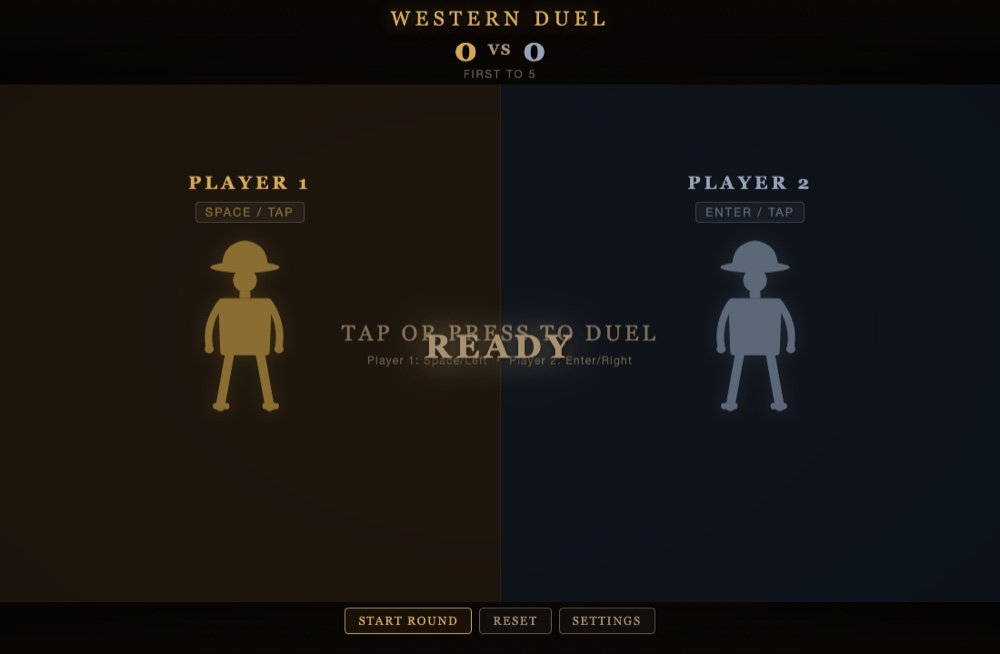

# Western Duel · Quick Draw Showdown 🤠

**▶ [Play now](https://renrenmimi.github.io/1v1--2/)** — runs in your browser, nothing to install.

High noon, two players, one keyboard. Wait for the signal — then draw. Fire early and you lose the round.

## Settings

- **Player names** for both sides
- **Target score** — first to N takes the match
- **Swap players** (L↔R)
- **Volume** and **vibration** toggles

## Tech

One `index.html` file. Two players share one keyboard.
